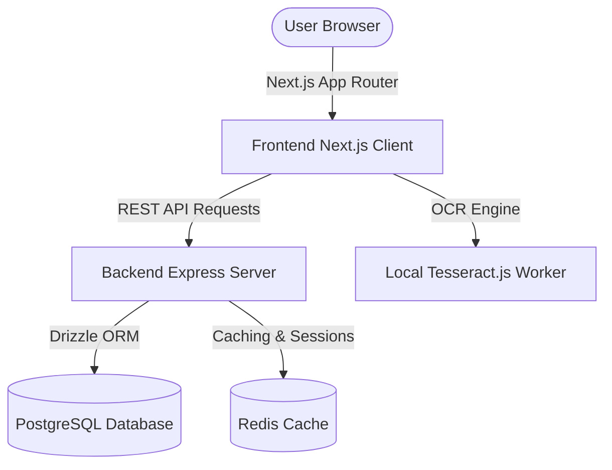

# Vellune

Vellune is a high-performance, premium web application designed for book lovers who want to organize their libraries, retain key insights using spaced-repetition reviews, and engage in intimate, spoiler-protected reading circles. 

Built with **Next.js (App Router)** on the frontend and **Node.js (Express)** on the backend, Vellune uses **PostgreSQL** (via Drizzle ORM) for database storage and **Redis** for state management, orchestrated locally using **Docker**.

---

## 🏗️ Architecture & Tech Stack

Vellune is designed as a split-monorepo with separate frontend and backend directories, communicating via a RESTful JSON API.

### Frontend
- **Framework**: Next.js 14 (App Router, Client-side rendering & state hydration)
- **State Management**: React Query (Server state synchronization) & Zustand (Client UI state)
- **Rich Text Editor**: TipTap (ProseMirror-based collaborative-ready editor)
- **OCR Engine**: Tesseract.js (Self-hosted language model client-side execution)
- **Styling**: Modern CSS variables & CSS Glassmorphism design system

### Backend
- **Framework**: Node.js (Express.js, TypeScript)
- **ORM & Migrations**: Drizzle ORM
- **Database**: PostgreSQL (Relational schema, indexes, cascading keys)
- **Caching & Sessions**: Redis (Session tokens, temporary timers, cache layers)
- **Deployment & Dev Ops**: Docker Compose (Multi-container orchestration)

---

## ⚡ Technical Highlights

* **Spoiler-Protected Discussions**: Implemented server-side filtering in Express/Drizzle to dynamically redact post content, sanitize author metadata, and zero out reaction counts if a post exceeds the reader's current page progress.
* **Client-Side Local OCR Scanner**: Integrated `tesseract.js` with $90^\circ$ manual canvas rotation. Configured the engine to serve language datasets directly from the local Next.js `/public` folder, eliminating CDN network latencies and offline failures.
* **Leitner Spaced-Repetition System**: Built a client-side box scheduler tracking recall scores (Box 1-5 box schedules) using partitioned local storage to prevent unnecessary database write overhead.
* **Cozy Soundscapes Mixer**: Designed an audio grid using React Hooks that manages clean unmount lifecycles for multiple HTML5 tracks with independent volume and loop controls.

## 🧪 Database Relational Design (Highlights)

Vellune's schema relies on strict integrity constraints. Key schemas are defined as:
* **Users & Books**: Standard library tables tracking reading targets, pages completed, and catalog metadata.
* **Reading Circles & Members**: One-to-many relationship with a membership cap constraints checker.
* **Discussion Threads & Posts**: Relational posts tracking user-progress gates (`pageReference`) and spoiler flags (`isSpoiler`). Includes a timed update restriction tracking `editWindowExpiresAt` to prevent historic discussion tampering.

---

## 📚 Documentation

* **[Quick Start Guide](docs/quick-start.md)**: Get up and running in 5 minutes.
* **[Backend Documentation](docs/backend.md)**: Detailed API and architecture documentation.
* **[Full Stack Setup](docs/setup.md)**: Comprehensive guide for full-stack development.

---

## 📄 License

MIT
